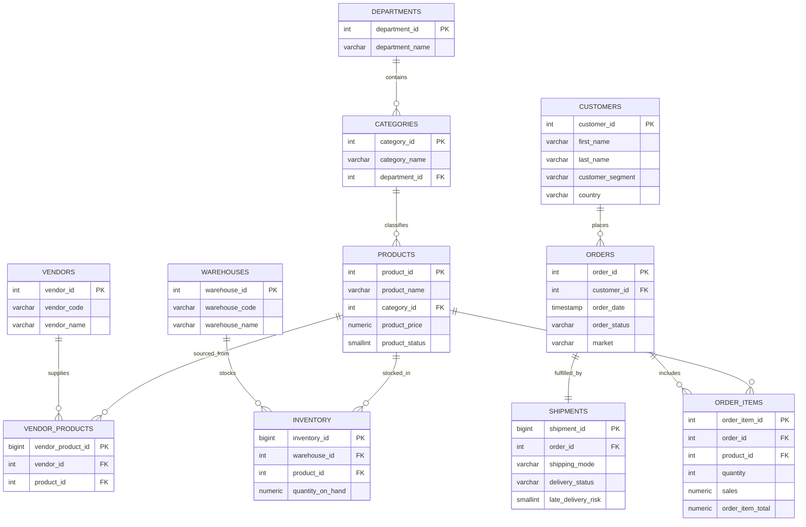

# SupplySight AI — Entity Relationship Diagram

**Database:** PostgreSQL  
**Model style:** Normalized 3NF-oriented OLTP/analytics hybrid (star-friendly facts + dimensions)  
**Source extract:** DataCo Supply Chain Dataset

---

## 1. Tables Overview

| Table | Role | Populated from DataCo? |
|-------|------|------------------------|
| `departments` | Merchandising department dimension | Yes |
| `categories` | Product category dimension | Yes |
| `products` | Product catalog | Yes |
| `customers` | Customer master | Yes |
| `orders` | Order header | Yes |
| `order_items` | Order line facts (primary grain) | Yes |
| `shipments` | Delivery / shipping profile | Yes |
| `warehouses` | Warehouse master | **No — placeholder** |
| `inventory` | Stock balances | **No — placeholder** |
| `vendors` | Supplier master | **No — placeholder** |
| `vendor_products` | Vendor–SKU bridge | **No — placeholder** |

---

## 2. Primary Keys

| Table | PK |
|-------|----|
| departments | `department_id` |
| categories | `category_id` |
| products | `product_id` (= Product Card Id) |
| customers | `customer_id` |
| orders | `order_id` |
| order_items | `order_item_id` |
| shipments | `shipment_id` (surrogate) + UNIQUE(`order_id`) |
| warehouses | `warehouse_id` |
| inventory | `inventory_id` |
| vendors | `vendor_id` |
| vendor_products | `vendor_product_id` |

---

## 3. Foreign Keys & Cardinality

| Relationship | Cardinality | FK |
|--------------|-------------|-----|
| departments → categories | 1 : N | `categories.department_id` |
| categories → products | 1 : N | `products.category_id` |
| customers → orders | 1 : N | `orders.customer_id` |
| orders → order_items | 1 : N | `order_items.order_id` |
| products → order_items | 1 : N | `order_items.product_id` |
| orders → shipments | 1 : 1 (current extract) | `shipments.order_id` UNIQUE |
| warehouses → inventory | 1 : N | `inventory.warehouse_id` |
| products → inventory | 1 : N | `inventory.product_id` |
| vendors → vendor_products | 1 : N | `vendor_products.vendor_id` |
| products → vendor_products | 1 : N | `vendor_products.product_id` |

---

## 4. Mermaid ER Diagram

---

## 5. Design Notes

- **Analytic grain:** `order_items` (180,519 unique `Order Item Id` values in source).
- **Shipment 1:1:** Current extract has one shipping profile per `Order Id`; schema allows future multi-parcel by dropping/relaxing uniqueness if needed.
- **Placeholders:** `warehouses`, `inventory`, `vendors` are production-shaped but intentionally empty until external feeds arrive.
- **No fabricated business rows** for placeholder tables.
