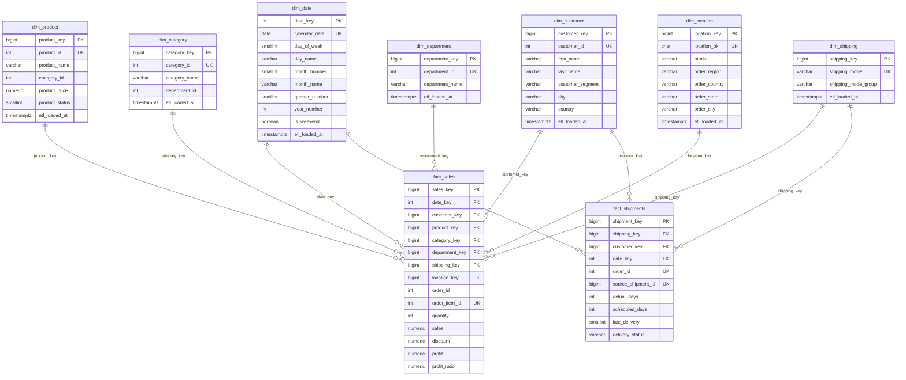
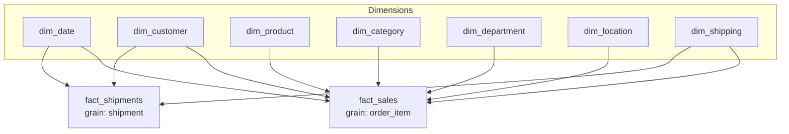

# Star Schema Diagram (Mermaid)

```mermaid
erDiagram
    dim_date {
        int date_key PK
        date calendar_date UK
        smallint day_of_week
        varchar day_name
        smallint month_number
        varchar month_name
        smallint quarter_number
        int year_number
        boolean is_weekend
        timestamptz etl_loaded_at
    }

    dim_customer {
        bigint customer_key PK
        int customer_id UK
        varchar first_name
        varchar last_name
        varchar customer_segment
        varchar city
        varchar country
        timestamptz etl_loaded_at
    }

    dim_product {
        bigint product_key PK
        int product_id UK
        varchar product_name
        int category_id
        numeric product_price
        smallint product_status
        timestamptz etl_loaded_at
    }

    dim_category {
        bigint category_key PK
        int category_id UK
        varchar category_name
        int department_id
        timestamptz etl_loaded_at
    }

    dim_department {
        bigint department_key PK
        int department_id UK
        varchar department_name
        timestamptz etl_loaded_at
    }

    dim_location {
        bigint location_key PK
        char location_bk UK
        varchar market
        varchar order_region
        varchar order_country
        varchar order_state
        varchar order_city
        timestamptz etl_loaded_at
    }

    dim_shipping {
        bigint shipping_key PK
        varchar shipping_mode UK
        varchar shipping_mode_group
        timestamptz etl_loaded_at
    }

    fact_sales {
        bigint sales_key PK
        int date_key FK
        bigint customer_key FK
        bigint product_key FK
        bigint category_key FK
        bigint department_key FK
        bigint shipping_key FK
        bigint location_key FK
        int order_id
        int order_item_id UK
        int quantity
        numeric sales
        numeric discount
        numeric profit
        numeric profit_ratio
    }

    fact_shipments {
        bigint shipment_key PK
        bigint shipping_key FK
        bigint customer_key FK
        int date_key FK
        int order_id UK
        bigint source_shipment_id UK
        int actual_days
        int scheduled_days
        smallint late_delivery
        varchar delivery_status
    }

    dim_date ||--o{ fact_sales : "date_key"
    dim_customer ||--o{ fact_sales : "customer_key"
    dim_product ||--o{ fact_sales : "product_key"
    dim_category ||--o{ fact_sales : "category_key"
    dim_department ||--o{ fact_sales : "department_key"
    dim_shipping ||--o{ fact_sales : "shipping_key"
    dim_location ||--o{ fact_sales : "location_key"

    dim_date ||--o{ fact_shipments : "date_key"
    dim_customer ||--o{ fact_shipments : "customer_key"
    dim_shipping ||--o{ fact_shipments : "shipping_key"
```

## Logical star (simplified)

```mermaid
flowchart TB
    subgraph dimensions["Dimensions"]
        D[dim_date]
        C[dim_customer]
        P[dim_product]
        CAT[dim_category]
        DEP[dim_department]
        L[dim_location]
        S[dim_shipping]
    end

    FS["fact_sales<br/>grain: order_item"]
    FSH["fact_shipments<br/>grain: shipment"]

    D --> FS
    C --> FS
    P --> FS
    CAT --> FS
    DEP --> FS
    L --> FS
    S --> FS

    D --> FSH
    C --> FSH
    S --> FSH
```
